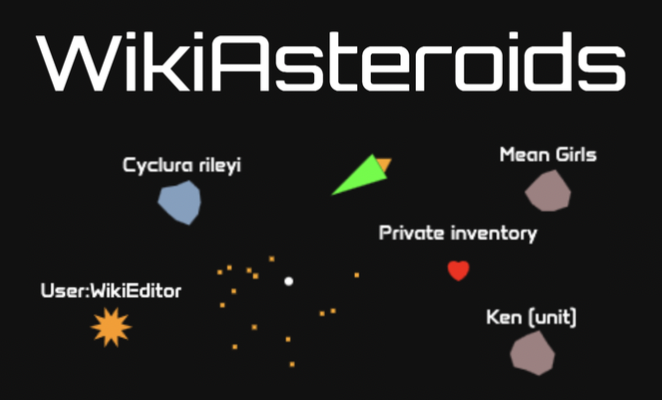

WikiAsteroids is the classic Asteroids game with a Wikipedia twist. Each edit to an article on Wikipedia spawns an asteroid.
* The larger the edit, the larger the asteroid (and the more shots it takes to destroy).
* Blue asteroids indicate additions, red asteroids indicate subtractions.
* When you destroy an asteroid, an article preview shows up in the sidebar with a link to the edit.
* At the bottom of this page, you can toggle edits from various language Wikipedias.

Edits are pulled via Wikimedia's [EventStreams](https://wikitech.wikimedia.org/wiki/Event_Platform/EventStreams_HTTP_Service) service.

This project was inspired by [Listen to Wikipedia](http://listen.hatnote.com/), a great project that lets you see and hear edits as they happen on Wikipedia.

# Credits
## Fonts
* [Anta](https://fonts.google.com/specimen/Anta) font by Sergej Lebedev ([SIL Open Font License, Version 1.1](https://fonts.google.com/specimen/Anta/license))
* [Orbitron](https://fonts.google.com/specimen/Orbitron) font by Matt McInerney ([SIL Open Font License, Version 1.1](https://fonts.google.com/specimen/Orbitron/license))

## Sound
In game sound effects are from freesound.org:
* Ship damaged sound by [CogFireStudios](https://freesound.org/people/CogFireStudios/) ([source](https://freesound.org/people/CogFireStudios/sounds/420356/))
* Final explosion sound by [SamsterBirdies](https://freesound.org/people/SamsterBirdies/) ([source](https://freesound.org/people/SamsterBirdies/sounds/621000/))
* Start/pause sound by [crisstanza](https://freesound.org/people/crisstanza/) ([source](https://freesound.org/people/crisstanza/sounds/167127/))
* Laser sound by [DeltaCode](https://freesound.org/people/DeltaCode/) ([source](https://freesound.org/people/DeltaCode/sounds/667650/))
* Triple laser sound by [DeltaCode](https://freesound.org/people/DeltaCode/) ([source](https://freesound.org/people/DeltaCode/sounds/667651/))
* Laser striking asteroid sound by [Huminaatio](https://freesound.org/people/Huminaatio/) ([source](https://freesound.org/people/Huminaatio/sounds/219101/))
* Powerup ending sound by [IndigoRay](https://freesound.org/people/IndigoRay/) ([source](https://freesound.org/people/IndigoRay/sounds/339131/))
* Explode all asteroids powerup sound by [bevibeldesign](https://freesound.org/people/bevibeldesign/) ([source](https://freesound.org/people/bevibeldesign/sounds/366088/))
* Faster fire powerup by [danlucaz](https://freesound.org/people/danlucaz/) ([source](https://freesound.org/people/danlucaz/sounds/517763/))
* Heart powerup sound by [Cman634](https://freesound.org/people/Cman634/) ([source](https://freesound.org/people/Cman634/sounds/198784/))
* Shield powerup sound by [GameAudio](https://freesound.org/people/GameAudio/) ([source](https://freesound.org/people/GameAudio/sounds/220173/))
* Slow motion powerup sound by [Silencer1337](https://freesound.org/people/Silencer1337/) ([source](https://freesound.org/people/Silencer1337/sounds/123921/))
* Spawn power up sound by [stwime](https://freesound.org/people/stwime/) ([source](https://freesound.org/people/stwime/sounds/545366/))
* Triple shot powerup sound by [colorsCrimsonTears](https://freesound.org/people/colorsCrimsonTears/) ([source](https://freesound.org/people/colorsCrimsonTears/sounds/607409/))
* Thrust sound by [mango777](https://freesound.org/people/mango777/) ([source](https://freesound.org/people/mango777/sounds/547442/))
